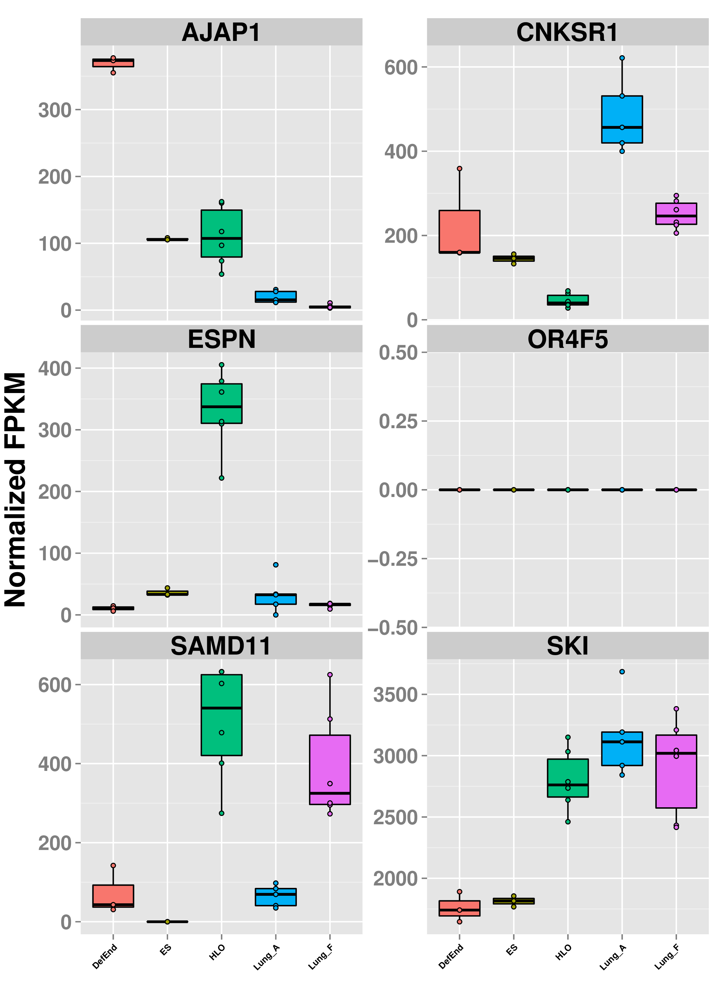
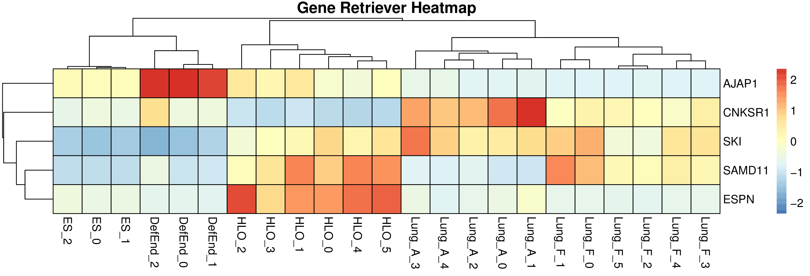

**SeqRetriever**

**AUTHORS:** David R. Hill and Shrikar Thodla

**PURPOSE:** To format gene expression data in a table and plot the data as box plots to generate an easy to read visual representation of the data. 

##R installation instructions for Mac OSX and Windows:
 http://cran.r-project.org/mirrors.html will lead you to a list of mirrors through which you can download R. Click on a mirror and then click on the download link that is appropriate for your operating system (Linux, Mac, or Windows). Follow instructions to install R.

##Required packages
GeneRetriever requires installation of several additional R packages.

	- ggplot2
	- pheatmap
	- RColorBrewer

Run the following command in the R console if you are unsure whether your R installation includes the required packages:
```R
install.packages(c("ggplot2","pheatmap","RColorBrewer"))
```

## Installation

```R
install.packages("devtools")
library("devtools")
devtools::install_github("hilldr/gene_retriever/GeneRetriever")
```

## Example
```R
library("GeneRetriever") # Loads the GeneRetriever function library
getGRexample() # Downloads and unpacks example dataset in working directory
GeneRetriever(gene.names=c("OR4F5","SAMD11","AJAP1","SKI","ESPN", "CNKSR1"),nrow=3,dir="./norm_out", pdf = TRUE, heatmap = TRUE) # Generates output files in the working directory
```
## FPKM matrix output
[Example FPKM matrix output](./GRoutput.csv)

## Boxplot output


This link will help you lern to interpret boxplots: http://www.wellbeingatschool.org.nz/information-sheet/understanding-and-interpreting-box-plots

## Heatmap output


## Additional user options and examples
```R
?GeneRetriever
```

##Please report all errors:
Please report all errors to Shrikar Thodla at sthodla@umich.edu with "GeneRetriever error" as the subject.
