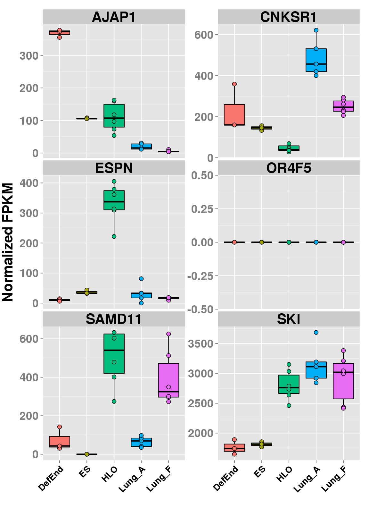
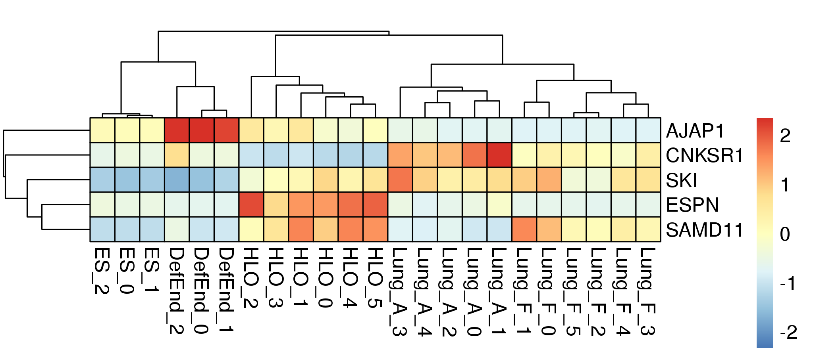

\*AUTHORS:\* David R. Hill and Shrikar Thodla

\*PURPOSE:\* An orgiginal R package designed to format gene expression
data in a table and plot the data as box plots to generate an easy to
read visual representation of the data.

Installation
============

If you have not installed the development tools package you will first
need to install "devtools" in R to access the SeqRetriever repository on
GitHub

``` {.r .rundoc-block rundoc-language="R" rundoc-session="*R*" rundoc-eval="yes"}
install.packages("devtools")
```

Then, install SeqRetriever as follows:

``` {.r .rundoc-block rundoc-language="R" rundoc-session="*R*" rundoc-eval="yes"}
library("devtools")
devtools::install_github("hilldr/SeqRetriever/SeqRetriever")
```

Required packages
-----------------

SeqRetriever requires installation of several additional R packages.

-   ggplot2
-   pheatmap
-   RColorBrewer
-   plyr
-   reshape

You will be prompted to install these pachages during the SeqRetriever
installation process. Alternately, you may run the following command in
the R console prior to installing SeqReriever:

``` {.r .rundoc-block rundoc-language="R" rundoc-session="*R*"}
    install.packages(c("ggplot2","pheatmap","RColorBrewer","plyr","reshape"))
```

### R installation instructions for Mac OSX and Windows:

<http://cran.r-project.org/mirrors.html> will lead you to a list of
mirrors through which you can download R. Click on a mirror and then
click on the download link that is appropriate for your operating system
(Linux, Mac, or Windows). Follow instructions to install R.

Example
=======

``` {.r .rundoc-block rundoc-language="R" rundoc-session="*R*"}
library("SeqRetriever") # Loads the SeqRetriever function library
getSRexample() # Downloads and unpacks example dataset in working directory
SeqRetriever(gene.names=c("OR4F5","SAMD11","AJAP1","SKI","ESPN", "CNKSR1"),nrow=3,dir="./norm_out", boxplot = TRUE, heatmap = TRUE) # Generates output files in the working directory
```

``` {.example}
3
```

FPKM matrix output
------------------

[Example FPKM matrix output](./SRoutput.csv)

Boxplot output
--------------

 This link will help you lern to interpret boxplots:
<http://www.wellbeingatschool.org.nz/information-sheet/understanding-and-interpreting-box-plots>

Heatmap output
--------------



Additional user options and examples
------------------------------------

``` {.r .rundoc-block rundoc-language="R" rundoc-session="*R*"}
?SeqRetriever
```

Please report all errors
========================

Please report all errors to David Hill at hilldr@med.umich.edu with
"SeqRetriever error" as the subject.

TODO Write description of SeqRetriever
======================================
