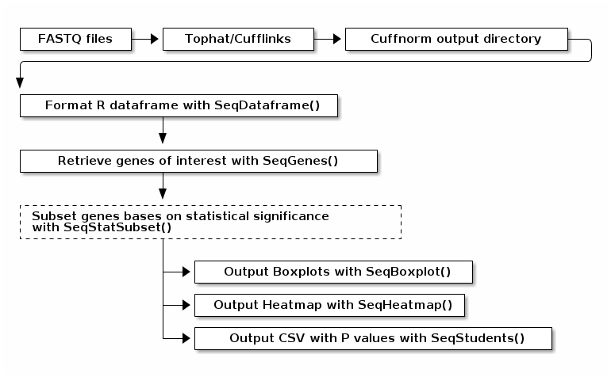
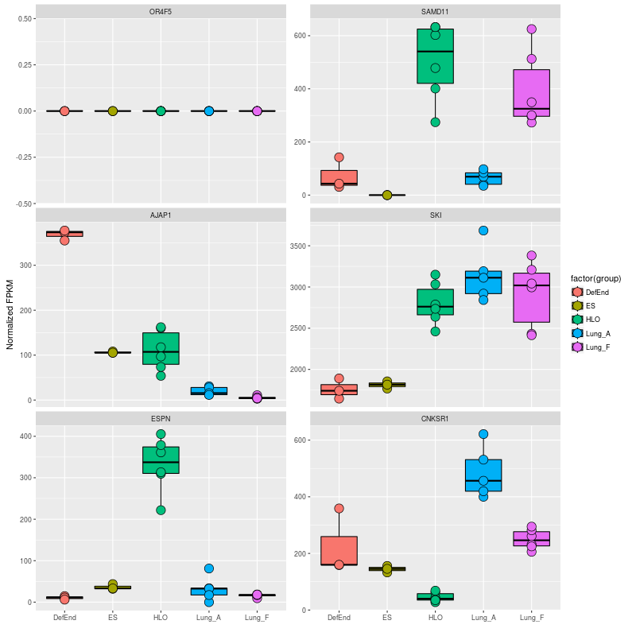
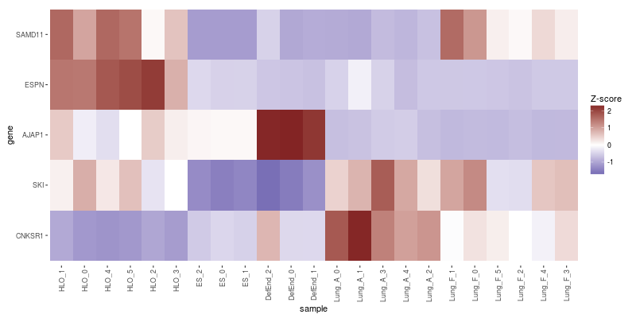
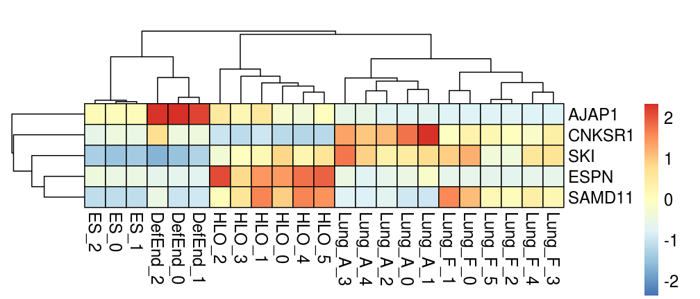

Aims
====

High throughput RNA sequencing is an incredibly powerful tool for
characterizing gene expression events ranging in scale from the complete
transcriptome of an organism or tissue to the expression of a single
rare RNA isoform accounting for the tiniest fraction of all
trancriptional activity in a cell.

SeqRetriever is designed to extract gene abundance data from the raw
output of the
[Tophat/Cufflinks](http://cole-trapnell-lab.github.io/cufflinks/)
transcriptome assembly and abundance estimation suite and convert it
into R dataframes, commonly used plots, and universal CSV output files.
This allows you to ask simple questions about differences in gene
expression and generate output that you can share with your colleagues,
advisors, collaborators, and reviewers without requiring a degree in
computer science or lengthy immersion in boring programming blogs. We
get it - you have papers that needed to be written yesterday and you
don't have time to learn to program. We're even okay with you analyzing
these output files in Excel if you want.

There are a variety of tools available for analyzing RNA-seq datasets in
the R environment, including the outstanding
[CummeRbund](http://compbio.mit.edu/cummeRbund/) package designed for
analyzing Cufflinks output which we highly recommend. SeqRetriever has
far fewer features, focusing exclusively on differential expression
analysis of assembled RNA-seq datasets. SeqRetriever aims to be the
first R package you run to answer a brand new question about gene
expression differences, but probably not the last one. This package is
designed to get you asking, answering, refining, and re-asking your
questions as quickly as possible.

Design criteria
===============

All functions in the SeqRetriever package are designed with the
following criteria in mind:

1.  Approachable - Anyone can generate meaningful, high quality data
    from RNA-seq datasets.
2.  Productive - Functions should be simple and intuitive. You shouldn't
    have to pull up ?SeqDataframe in every R session. SeqRetriever
    functions should free your mind to think about science,
    not programming.
3.  Readable - Good R script is easy to follow and, therefore, easier to
    share and debug. While discrete functions in SeqRetriever can be
    sequenced together in a pipeline to perform complex tasks, the
    induvidual SeqRetriever functions perform simple tasks and can be
    used independently of other SeqRetriever functions.

Work flow
=========



Examples
========

Setup database
--------------

``` {.r .rundoc-block rundoc-language="R" rundoc-session="*R*" rundoc-exports="code" rundoc-eval="yes"}
library(SeqRetriever)
getSRexample() # Downloads and unpacks example dataset in working directory
testdf <- SeqDataframe(dir = "./norm_out") # format dataframe
```

Select genes
------------

``` {.r .rundoc-block rundoc-language="R" rundoc-session="*R*" rundoc-exports="code" rundoc-eval="yes"}
genes <- SeqGenes(df = testdf,gene.names = c("OR4F5","SAMD11","AJAP1","SKI","ESPN", "CNKSR1"))
```

``` {.r .rundoc-block rundoc-language="R" rundoc-session="*R*" rundoc-exports="both" rundoc-results="graphics" rundoc-file="./img/boxplots.png" rundoc-width="800" rundoc-height="800" rundoc-eval="yes"}
plot <- SeqBoxplot(genes)
print(plot)
```



Print Heatmap
-------------

``` {.r .rundoc-block rundoc-language="R" rundoc-session="*R*" rundoc-exports="both" rundoc-results="graphics" rundoc-file="./img/heatmap.png" rundoc-width="800" rundoc-height="400" rundoc-eval="yes"}
SeqHeatmap(genes)
```



### Print pHeatmap

This is an alternate implementation of the heatmap output using the
library "pheatmap". This method will return high quality plots but lacks
the flexibility of the standard ggplot2 format output returned by
SeqHeatmap()

``` {.r .rundoc-block rundoc-language="R" rundoc-session="*R*" rundoc-exports="both" rundoc-results="graphics" rundoc-file="./img/pheatmap.png" rundoc-eval="yes"}
SeqpHeatmap(genes, hm.name = "pheatmap.png", w = 7, h = 3)
```



Print boxplot showing only genes that differ significantly between "HLO" and "Lung~A~"
--------------------------------------------------------------------------------------

``` {.r .rundoc-block rundoc-language="R" rundoc-session="*R*" rundoc-exports="both" rundoc-results="graphics" rundoc-file="./img/sig-boxplots.png" rundoc-width="800" rundoc-height="400" rundoc-eval="yes"}
sig.genes <- SeqStatSubset(genes, limit = 0.001, group1 = "HLO", group2 = "Lung_A")
plot2 <- SeqBoxplot(sig.genes, nrow = 1)
print(plot2)
```


Using [magrittr](https://github.com/smbache/magrittr) syntax
------------------------------------------------------------

SeqRetriever is designed with
[magrittr](https://github.com/smbache/magrittr) syntax in mind. You may
find that this improved the readability of your work in SeqRetriever.
For example:

``` {.r .rundoc-block rundoc-language="R" rundoc-session="*R*" rundoc-exports="both" rundoc-results="graphics" rundoc-file="./img/magrittr-boxplots.png" rundoc-width="800" rundoc-height="400" rundoc-eval="yes"}
library(magrittr)
SeqDataframe(dir = "./norm_out") %>% # Create the dataframe
    SeqGenes(gene.names = c("PAX7", "CDA", "TCEB3",
                            "EXTL1", "HES3", "DFFB")) %>% # select genes to plot
    SeqBoxplot(nrow = 2, size = 2) %>% # generate boxplot and pass to print
    print()
```


Here is another example using the SeqStatSubset() function to plot only
highly significant genes as a heatmap

``` {.r .rundoc-block rundoc-language="R" rundoc-session="*R*" rundoc-exports="both" rundoc-results="graphics" rundoc-file="./img/magrittr-heatmap.png" rundoc-width="800" rundoc-height="800" rundoc-eval="yes"}
library(magrittr)
SeqDataframe(dir = "./norm_out") %>%
    SeqStatSubset(limit = 0.001,
                  Bonferroni = TRUE,
                  group1 = "ES", group2 = "HLO") %>%
    SeqHeatmap() %>%
    print()
```


Now lets try modifying the heatmap with ggplot2 as an illustration of
the flexibility of SeqHeatmap

``` {.r .rundoc-block rundoc-language="R" rundoc-session="*R*" rundoc-exports="both" rundoc-results="graphics" rundoc-file="./img/magrittr-heatmap2.png" rundoc-width="800" rundoc-height="800" rundoc-eval="yes"}
df <- SeqDataframe(dir = "./norm_out") 
df <- SeqStatSubset(df,limit = 0.001,
                  Bonferroni = TRUE,
                  group1 = "ES", group2 = "HLO")
plot <- SeqHeatmap(df)

# make a custom color spectrum 
library(RColorBrewer)
# These are the colors used in SeqpHeatmap()
colors <- colorRampPalette(rev(brewer.pal(n=7, name="RdYlBu")))(300)

plot <- plot + scale_fill_gradient2("Z- score",low=colors[1], high=colors[300], mid=colors[150]) +
    xlab("") + ylab("") + coord_fixed(ratio = 1) +
    theme(axis.text = element_text(size = 18, face ="bold"),
          axis.text.x = element_text(angle = 45, vjust = 1, hjust = 1),
          legend.title = element_text(size = 18, face ="bold"),
          legend.text = element_text(size = 12, face ="bold"))

print(plot)
```


An alternate approach using magrittr syntax. This will produce a plot
identical to the one above.

``` {.r .rundoc-block rundoc-language="R" rundoc-session="*R*" rundoc-exports="code"}
# make a custom color spectrum 
library(RColorBrewer)
# These are the colors used in SeqpHeatmap()
colors <- colorRampPalette(rev(brewer.pal(n=7, name="RdYlBu")))(300)

library(magrittr)
plot <- SeqDataframe(dir = "./norm_out") %>%
    SeqStatSubset(limit = 0.001,
                  Bonferroni = TRUE,
                  group1 = "ES",
                  group2 = "HLO") %>%
    SeqHeatmap()
# No real advantage to magrittr for adjusting ggplot2 objects. The '+' operator already works great
plot <- plot + scale_fill_gradient2("Z-score",low=colors[1], high=colors[300], mid=colors[150]) +
    xlab("") + ylab("") +
    theme(axis.text = element_text(size = 18, face ="bold"),
          axis.text.x = element_text(angle = 45, vjust = 1, hjust = 1),
          legend.title = element_text(size = 18, face ="bold"),
          legend.text = element_text(size = 12, face ="bold"))

print(plot)

```

See [the ggplot2 theme
documentation](http://docs.ggplot2.org/0.9.3.1/theme.html%20) for a
complete list of modifiable theme elements.

Installation
============

If you have not installed the development tools package you will first
need to install "devtools" in R to access the SeqRetriever repository on
GitHub

``` {.r .rundoc-block rundoc-language="R" rundoc-session="*R*" rundoc-eval="no"}
install.packages("devtools")
```

Then, install SeqRetriever as follows:

``` {.r .rundoc-block rundoc-language="R" rundoc-session="*R*" rundoc-eval="no"}
library("devtools")
devtools::install_github("hilldr/SeqRetriever/SeqRetriever")
```

### R installation instructions for Mac OSX and Windows:

<http://cran.r-project.org/mirrors.html> will lead you to a list of
mirrors through which you can download R. Click on a mirror and then
click on the download link that is appropriate for your operating system
(Linux, Mac, or Windows). Follow instructions to install R.

Please report all errors
========================

Please report all errors to David Hill at hilldr@med.umich.edu with
"SeqRetriever error" as the subject.
