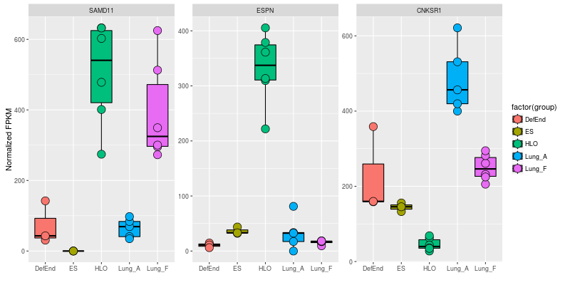

<h2>Table of Contents</h2>

<ul>
<li><a href="#sec-1">1. Aims</a></li>
<li><a href="#sec-2">2. Design criteria</a></li>
<li><a href="#sec-3">3. Work flow</a></li>
<li><a href="#sec-4">4. Examples</a>
<ul>
<li><a href="#sec-4-1">4.1. Setup database</a></li>
<li><a href="#sec-4-2">4.2. Select genes</a></li>
<li><a href="#sec-4-3">4.3. Print boxplot</a></li>
<li><a href="#sec-4-4">4.4. Print Heatmap</a>
<ul>
<li><a href="#sec-4-4-1">4.4.1. Print pHeatmap</a></li>
</ul>
</li>
<li><a href="#sec-4-5">4.5. Print boxplot showing only genes that differ significantly between "HLO" and "LungA"</a></li>
<li><a href="#sec-4-6">4.6. Using magrittr syntax</a></li>
<li><a href="#sec-4-7">4.7. Statistical tests</a>
<ul>
<li><a href="#sec-4-7-1">4.7.1. Analysis of variance (ANOVA)</a></li>
<li><a href="#sec-4-7-2">4.7.2. Add Student's t-test for ES vs. DefEnd</a></li>
</ul>
</li>
</ul>
</li>
<li><a href="#sec-5">5. Installation</a>
<ul>
<li>
<ul>
<li><a href="#sec-5-0-1">5.0.1. R installation instructions for Mac OSX and Windows:</a></li>
</ul>
</li>
</ul>
</li>
<li><a href="#sec-6">6. Please report all errors</a></li>
</ul>

# Aims

High throughput RNA sequencing is an incredibly powerful tool for characterizing gene expression events ranging in scale from the complete transcriptome of an organism or tissue to the expression of a single rare RNA isoform accounting for the tiniest fraction of all trancriptional activity in a cell.  

SeqRetriever is designed to extract gene abundance data from the raw output of the [Tophat/Cufflinks](http://cole-trapnell-lab.github.io/cufflinks/) transcriptome assembly and abundance estimation suite and convert it into R dataframes, commonly used plots, and universal CSV output files. This allows you to ask simple questions about differences in gene expression and generate output that you can share with your colleagues, advisors, collaborators, and reviewers without requiring a degree in computer science or lengthy immersion in boring programming blogs. We get it - you have papers that needed to be written yesterday and you don't have time to learn to program. We're even okay with you analyzing these output files in Excel if you want.

There are a variety of tools available for analyzing RNA-seq datasets in the R environment, including the outstanding [CummeRbund](http://compbio.mit.edu/cummeRbund/) package designed for analyzing Cufflinks output which we highly recommend. SeqRetriever has far fewer features, focusing exclusively on differential expression analysis of assembled RNA-seq datasets. SeqRetriever aims to be the first R package you run to answer a brand new question about gene expression differences, but probably not the last one. This package is designed to get you asking, answering, refining, and re-asking your questions as quickly as possible.

# Design criteria

All functions in the SeqRetriever package are designed with the following criteria in mind:

1.  Approachable - Anyone can generate meaningful, high quality data from RNA-seq datasets.
2.  Productive - Functions should be simple and intuitive. You shouldn't have to pull up ?SeqDataframe in every R session. SeqRetriever functions should free your mind to think about science, not programming.
3.  Readable - Good R script is easy to follow and, therefore, easier to share and debug. While discrete functions in SeqRetriever can be sequenced together in a pipeline to perform complex tasks, the induvidual SeqRetriever functions perform simple tasks and can be used independently of other SeqRetriever functions.

# Work flow

# Examples

## Setup database

    library(SeqRetriever)
    getSRexample() # Downloads and unpacks example dataset in working directory
    testdf <- SeqDataframe(dir = "./norm_out") # format dataframe

## Select genes

    genes <- SeqGenes(df = testdf,gene.names = c("OR4F5","SAMD11","AJAP1","SKI","ESPN", "CNKSR1"))

## Print boxplot

    plot <- SeqBoxplot(genes)
    print(plot)

## Print Heatmap

    SeqHeatmap(genes)

### Print pHeatmap

This is an alternate implementation of the heatmap output using the library "pheatmap". This method will return high quality plots but lacks the flexibility of the standard ggplot2 format output returned by SeqHeatmap()

    SeqpHeatmap(genes, hm.name = "pheatmap.png", w = 7, h = 3)

## Print boxplot showing only genes that differ significantly between "HLO" and "LungA"

    sig.genes <- SeqStatSubset(genes, limit = 0.001, group1 = "HLO", group2 = "Lung_A")
    plot2 <- SeqBoxplot(sig.genes, nrow = 1)
    print(plot2)

## Using [magrittr](https://github.com/smbache/magrittr) syntax

SeqRetriever is designed with [magrittr](https://github.com/smbache/magrittr) syntax in mind. You may find that this improves the readability of your work in SeqRetriever. For example:

    library(magrittr)
    SeqDataframe(dir = "./norm_out") %>% # Create the dataframe
        SeqGenes(gene.names = c("PAX7", "CDA", "TCEB3",
                                "EXTL1", "HES3", "DFFB")) %>% # select genes to plot
        SeqBoxplot(nrow = 2, size = 2) %>% # generate boxplot and pass to print
        print()

Here is another example using the SeqStatSubset() function to plot only highly significant genes as a heatmap

    library(magrittr)
    SeqDataframe(dir = "./norm_out") %>%
        SeqStatSubset(limit = 0.001,
                      p.adjust = TRUE,
                      p.adjust.method = "bonferroni",
                      group1 = "ES", group2 = "HLO") %>%
        SeqHeatmap() %>%
        print()

Now lets try modifying the heatmap with ggplot2 as an illustration of the flexibility of SeqHeatmap

    df <- SeqDataframe(dir = "./norm_out") 
    df <- SeqStatSubset(df,limit = 0.001,
                        p.adjust = TRUE,
                        p.adjust.method = "bonferroni",
                        group1 = "ES", group2 = "HLO")
    plot <- SeqHeatmap(df)
    
    # make a custom color spectrum 
    library(RColorBrewer)
    # These are the colors used in SeqpHeatmap()
    colors <- colorRampPalette(rev(brewer.pal(n=7, name="RdYlBu")))(300)
    
    plot <- plot + scale_fill_gradient2("Z- score",low=colors[1], high=colors[300], mid=colors[150]) +
        xlab("") + ylab("") + coord_fixed(ratio = 1) +
        theme(axis.text = element_text(size = 18, face ="bold"),
              axis.text.x = element_text(angle = 45, vjust = 1, hjust = 1),
              legend.title = element_text(size = 18, face ="bold"),
              legend.text = element_text(size = 12, face ="bold"))
    
    print(plot)

An alternate approach using magrittr syntax and also showing additional formatting examples.

    ## make a custom color spectrum 
    library(RColorBrewer)
    ## These are the colors used in SeqpHeatmap()
    colors <- colorRampPalette(rev(brewer.pal(n=7, name="RdYlBu")))(300)
    
    library(magrittr)
    SeqDataframe(dir = "./norm_out") %>%
        SeqStatSubset(limit = 0.001,
                      p.adjust = TRUE,
                      p.adjust.method = "bonferroni",
                      group1 = "ES",
                      group2 = "HLO") %>%
        SeqHeatmap() %>%
        + scale_fill_gradient2("Z-score",
                               low = colors[1],
                               high = colors[300],
                               mid = colors[150]) %>%
          + xlab("") %>% + ylab("") %>% + coord_fixed(ratio = 1) %>%
          + geom_tile(color = "black", size = 0.5) %>% 
          + theme(axis.text = element_text(size = 18, face ="bold"),
                  axis.text.x = element_text(angle = 45, vjust = 1, hjust = 1),
                  legend.title = element_text(size = 18, face ="bold"),
                  legend.text = element_text(size = 12, face ="bold")) %>%
            print()

See [the ggplot2 theme documentation](http://docs.ggplot2.org/0.9.3.1/theme.html%20) for a complete list of modifiable theme elements.

## Statistical tests

### Analysis of variance (ANOVA)

    testdf <- SeqDataframe(dir = "./norm_out")
    testdf <- SeqANOVA(df = testdf)
    str(testdf)

    png 
      3
     png 
      3 
    There were 22 warnings (use warnings() to see them)
     Scale for 'fill' is already present. Adding another scale for 'fill', which
    will replace the existing scale.
    png 
      3 
    There were 22 warnings (use warnings() to see them)
     Scale for 'fill' is already present. Adding another scale for 'fill', which
    will replace the existing scale.
    png 
      3 
    There were 22 warnings (use warnings() to see them)
    'data.frame':   196 obs. of  26 variables:
     $ gene_short_name: chr  "AADACL3" "AADACL4" "ACTL8" "ACTRT2" ...
     $ ES_0           : num  21.49 2.15 5.37 0 519.06 ...
     $ ES_2           : num  20.9 0 18 0 532.5 ...
     $ ES_1           : num  27.22 3.55 7.1 0 530.23 ...
     $ DefEnd_2       : num  7.3 0 1.22 0 1259.06 ...
     $ DefEnd_0       : num  0 0 0 0 496 ...
     $ DefEnd_1       : num  19.99 0 1.54 0 412.01 ...
     $ Lung_A_0       : num  0 0 0 0 2464 ...
     $ Lung_A_4       : num  0 0 0 0 2815 ...
     $ Lung_A_3       : num  0 0 0 0 5325 ...
     $ Lung_A_1       : num  2.8 0 0 0 3217.5 ...
     $ Lung_A_2       : num  0 0 0 0 3765 ...
     $ HLO_2          : num  0 0 0 0 7072 ...
     $ HLO_3          : num  0 0.834 0.834 0 5666.36 ...
     $ HLO_4          : num  0 0.998 0 0 5961.73 ...
     $ HLO_0          : num  0 0.933 0 0 6181.7 ...
     $ HLO_5          : num  0 1 0 0 7502 ...
     $ HLO_1          : num  0 0.558 0.558 0 8990.83 ...
     $ Lung_F_5       : num  1.96 0.98 0 0 4319.03 ...
     $ Lung_F_2       : num  2.616 0.327 0 0 4843.45 ...
     $ Lung_F_4       : num  2.479 0.413 0 0 5947.69 ...
     $ Lung_F_1       : num  1.066 0.355 0 0 6565.63 ...
     $ Lung_F_0       : num  2.45 1.23 0 0 8284.87 ...
     $ Lung_F_3       : num  4.03 1.21 0 0 6779.34 ...
     $ anova.p        : num  3.88e-07 1.05e-04 5.96e-02 NaN 1.00 ...
     $ anova.p.adj    : num  7.61e-05 2.07e-02 1.00 NaN 1.00 ...

### Add Student's t-test for ES vs. DefEnd

    testdf <- SeqStudents(testdf,
                          group1 = "DefEnd",
                          group2 = "ES",
                          p.adjust.method = "BH") # Benjamini & Hochberg corection
    str(testdf)

='data.frame':        196 obs. of  31 variables:
 $ geneshortname        : chr  "AADACL3" "AADACL4" "ACTL8" "ACTRT2" &#x2026;
 $ ES0                   : num  21.49 2.15 5.37 0 519.06 &#x2026;
 $ ES2                   : num  20.9 0 18 0 532.5 &#x2026;
 $ ES1                   : num  27.22 3.55 7.1 0 530.23 &#x2026;
 $ DefEnd2               : num  7.3 0 1.22 0 1259.06 &#x2026;
 $ DefEnd0               : num  0 0 0 0 496 &#x2026;
 $ DefEnd1               : num  19.99 0 1.54 0 412.01 &#x2026;
 $ LungA0               : num  0 0 0 0 2464 &#x2026;
 $ LungA4               : num  0 0 0 0 2815 &#x2026;
 $ LungA3               : num  0 0 0 0 5325 &#x2026;
 $ LungA1               : num  2.8 0 0 0 3217.5 &#x2026;
 $ LungA2               : num  0 0 0 0 3765 &#x2026;
 $ HLO2                  : num  0 0 0 0 7072 &#x2026;
 $ HLO3                  : num  0 0.834 0.834 0 5666.36 &#x2026;
 $ HLO4                  : num  0 0.998 0 0 5961.73 &#x2026;
 $ HLO0                  : num  0 0.933 0 0 6181.7 &#x2026;
 $ HLO5                  : num  0 1 0 0 7502 &#x2026;
 $ HLO1                  : num  0 0.558 0.558 0 8990.83 &#x2026;
 $ LungF5               : num  1.96 0.98 0 0 4319.03 &#x2026;
 $ LungF2               : num  2.616 0.327 0 0 4843.45 &#x2026;
 $ LungF4               : num  2.479 0.413 0 0 5947.69 &#x2026;
 $ LungF1               : num  1.066 0.355 0 0 6565.63 &#x2026;
 $ LungF0               : num  2.45 1.23 0 0 8284.87 &#x2026;
 $ LungF3               : num  4.03 1.21 0 0 6779.34 &#x2026;
 $ anova.p                : num  3.88e-07 1.05e-04 5.96e-02 NaN 1.00 &#x2026;
 $ anova.p.adj            : num  7.61e-05 2.07e-02 1.00 NaN 1.00 &#x2026;
 $ Mean.DefEnd            : num  9.095 0 0.918 0 722.52 &#x2026;
 $ Mean.ES                : num  23.2 1.9 10.2 0 527.3 &#x2026;
 $ log2.DefEnd.ovr.ES     : num  -1.351 -Inf -3.47 NaN 0.455 &#x2026;
 $ ttest.DefEnd.v.ES.p    : num  0.0845 0.1396 0.0813 NaN 0.5087 &#x2026;
 $ ttest.DefEnd.v.ES.p.adj: num  0.21 0.294 0.204 NaN 0.779 &#x2026;
=\*\*\* Add Student's t-test for LungA vs. LungF

    testdf <- SeqStudents(testdf,
                          group1 = "Lung_A",
                          group2 = "Lung_F",
                          p.adjust.method = "BH") # Benjamini & Hochberg corection
    str(testdf)

    'data.frame':   196 obs. of  36 variables:
     $ gene_short_name            : chr  "AADACL3" "AADACL4" "ACTL8" "ACTRT2" ...
     $ ES_0                       : num  21.49 2.15 5.37 0 519.06 ...
     $ ES_2                       : num  20.9 0 18 0 532.5 ...
     $ ES_1                       : num  27.22 3.55 7.1 0 530.23 ...
     $ DefEnd_2                   : num  7.3 0 1.22 0 1259.06 ...
     $ DefEnd_0                   : num  0 0 0 0 496 ...
     $ DefEnd_1                   : num  19.99 0 1.54 0 412.01 ...
     $ Lung_A_0                   : num  0 0 0 0 2464 ...
     $ Lung_A_4                   : num  0 0 0 0 2815 ...
     $ Lung_A_3                   : num  0 0 0 0 5325 ...
     $ Lung_A_1                   : num  2.8 0 0 0 3217.5 ...
     $ Lung_A_2                   : num  0 0 0 0 3765 ...
     $ HLO_2                      : num  0 0 0 0 7072 ...
     $ HLO_3                      : num  0 0.834 0.834 0 5666.36 ...
     $ HLO_4                      : num  0 0.998 0 0 5961.73 ...
     $ HLO_0                      : num  0 0.933 0 0 6181.7 ...
     $ HLO_5                      : num  0 1 0 0 7502 ...
     $ HLO_1                      : num  0 0.558 0.558 0 8990.83 ...
     $ Lung_F_5                   : num  1.96 0.98 0 0 4319.03 ...
     $ Lung_F_2                   : num  2.616 0.327 0 0 4843.45 ...
     $ Lung_F_4                   : num  2.479 0.413 0 0 5947.69 ...
     $ Lung_F_1                   : num  1.066 0.355 0 0 6565.63 ...
     $ Lung_F_0                   : num  2.45 1.23 0 0 8284.87 ...
     $ Lung_F_3                   : num  4.03 1.21 0 0 6779.34 ...
     $ anova.p                    : num  3.88e-07 1.05e-04 5.96e-02 NaN 1.00 ...
     $ anova.p.adj                : num  7.61e-05 2.07e-02 1.00 NaN 1.00 ...
     $ Mean.DefEnd                : num  9.095 0 0.918 0 722.52 ...
     $ Mean.ES                    : num  23.2 1.9 10.2 0 527.3 ...
     $ log2.DefEnd.ovr.ES         : num  -1.351 -Inf -3.47 NaN 0.455 ...
     $ ttest.DefEnd.v.ES.p        : num  0.0845 0.1396 0.0813 NaN 0.5087 ...
     $ ttest.DefEnd.v.ES.p.adj    : num  0.21 0.294 0.204 NaN 0.779 ...
     $ Mean.Lung_A                : num  0.56 0 0 0 3517.37 ...
     $ Mean.Lung_F                : num  2.434 0.752 0 0 6123.335 ...
     $ log2.Lung_A.ovr.Lung_F     : num  -2.12 -Inf NaN NaN -0.8 ...
     $ ttest.Lung_A.v.Lung_F.p    : num  0.0205 0.00395 NaN NaN 0.00913 ...
     $ ttest.Lung_A.v.Lung_F.p.adj: num  0.0406 0.0109 NaN NaN 0.0208 ...

# Installation

If you have not installed the development tools package you will first need to install "devtools" in R to access the SeqRetriever repository on GitHub

    install.packages("devtools")

Then, install SeqRetriever as follows:

    library("devtools")
    devtools::install_github("hilldr/SeqRetriever/SeqRetriever")

### R installation instructions for Mac OSX and Windows:

<http://cran.r-project.org/mirrors.html> will lead you to a list of
mirrors through which you can download R. Click on a mirror and then
click on the download link that is appropriate for your operating system
(Linux, Mac, or Windows). Follow instructions to install R.

# Please report all errors

Please report all errors to David Hill at hilldr@med.umich.edu with
"SeqRetriever error" as the subject.
